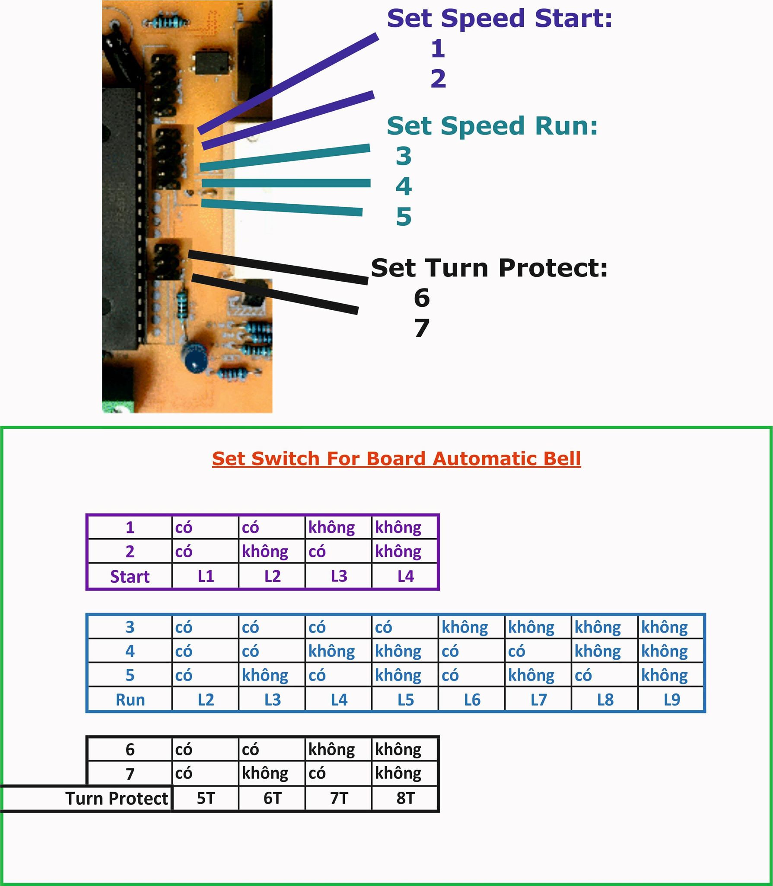

# Hệ Thống Giật Chuông Tự Động Giáo Xứ Cao Mộc

  

## Về Phía Người Sử Dụng
### Chức năng các phím nhấn mạch điều khiển
#### sự kiện hàng tuần
- ở màn hình chính >> ***phím A*** để chuyển sang màn hình duyệt sự kiện lặp lại mỗi tuần
- tiếp tục nhấn ***phím A*** để duyệt qua hàng loạt các sự kiện
- dừng ở sự kiện bất kỳ >> ***phím B*** để đặt lại thời gian, relay, ... tương ứng >> *Trong lúc đặt giá trị có thể dùng ***phím B*** hoặc ***phím C*** để tiến/lùi*
#### sự kiện tuỳ chỉnh
- ở màn hình chính >> ***phím D*** để chuyển sang màn hình duyệt sự kiện tuỳ chỉnh
- tiếp tục nhấn ***phím D*** để duyệt qua hàng loạt các sự kiện
- ở màn hình chính hoặc trong khi đang duyệt sự kiện tuỳ chỉnh >> ***nhấn giữ phím D*** để thêm sự kiện tuỳ chỉnh mới >> *Trong lúc đặt giá trị có thể dùng ***phím B*** hoặc ***phím C*** để tiến/lùi*
- dừng ở sự kiện bất kỳ >> ***nhấn giữ phím #*** để xoá sự kiện đó
#### Bổ sung
- nguyên tắc chọn relay: ***phím 1 hoặc phím bất kỳ khác 0*** >> bật relay, ***phím 0*** >> tắt relay
- khi chỉnh sửa sự kiện hàng tuần >> phải đặt lại tất cả các thông số, ~~không được chuyển thẳng đến thông số cần thao tác và chỉnh sửa **MỖI** thông số đó~~
- nếu thời gian thực bị lệch so với thực tế thì tiến hành cân chỉnh bằng cách từ màn hình chính >> nhấn giữ ***phím * ***

### Lưu ý khi thao tác
- đặt thời gian theo hệ 24 giờ. VD: 12h00 >> 12:00 giờ trưa, 00h01 >> 12:01 khuya, 16h30 >> 4:30 chiều
- đọc kỹ phần *Chức năng phím nhấn* phía trên. Tuyệt đối không nhấn phím ngẫu nhiên khi đang thao tác trên màn hình không liên quan để tránh gây lỗi chương trình. ~~VD: nhấn D ở màn hình duyệt sự kiện là vô nghĩa, nhấn các phím số ở màn hình chính là vô nghĩa~~
- không nhấn phím liên tục, nhấn quá nhanh, nhấn nhiều phím cùng lúc
- không được đặt sự kiện tuỳ chỉnh trùng khớp thời gian với các sự kiện hàng ngày >> tránh xung đột
- không đặt 2 hoặc nhiều sự kiện tuỳ chỉnh trùng khớp thời gian với nhau >> tránh xung đột
- khi treo màn hình >> nhấn nút reset hệ thống
- khi đặt sự kiện hàng ngày lưu ý chọn mốc thời gian trong ngày tương ứng với mốc thời gian trên màn hình. ~~VD: Đặt chuông buổi SÁNG lúc 16h30 CHIỀU là vô lý~~
- nên kiểm tra qua tất cả các sự kiện để chắc chắn cài đặt sự kiện thành công
- sau khi hoàn tất mọi cài đặt thời gian thì phải quay lại được màn hình chính để chương trình tự động về chế độ hẹn giờ và tự động tắt màn hình tiết kiệm năng lượng >> nếu không quay về được có thể nhấn reset. Sau đó mới đóng nắp tủ điện
 
 ### Chỉnh các chế độ trên mạch công suất
 

  

 
## Dev
### Sự kiện mỗi ngày: 7 cells  X  3 buổi mỗi ngày  X  7 ngày trong tuần  =  147 cells. 0 -> 146
| 0 | 1 | 2 | 3 | 4 | 5 | 6 | ... |
| - | - | - | - | - | - | - | --- |
| WeekDay | Hour | Minute | Relay1 | Relay2 | Relay3 | Duration | *lặp lại* |

### Sự kiện tuỳ chỉnh: ô 147 *<số sự kiện tuỳ chỉnh hiện tại>*  +  10 cells  X  đến hết ô nhớ EEPr (1024 bytes). 147 | 148 -> 1023
| 148 | 149 | 150 | 151 | 152 | 153 | 154 | 155 | 156 | 157 | ... |
| --- | --- | --- | --- | --- | --- | --- | --- | --- | --- | --- |
| MonthDate | Month | Year1 *<hàng nghìn & hàng trăm>* | Year2 *<hàng chục & hàng đơn vị>* | Hour | Minute | Relay1 | Relay2 | Relay3 | Duration | *lặp lại* |

### Linh tinh
- ô thứ *148 + 10n* là các ô MonthDate nếu về 0 thì khi duyệt qua các sự kiện sẽ dừng lại ở đó >> nếu #0 thì bỏ qua
- ô 1025, 1026, 1027 lưu 3 biến duration RF tương ứng 3 relay
- biến *arrTick[256]* map tạm thời toàn bộ EEPr cells để làm biến tạm set sự kiện trước khi trả về EEPr
- khi bắt event: nhấn A để xác nhận sẽ trùng nhấn A duyệt daily events, nhấn giữ D để thêm custom events sẽ trùng với nhấn D duyệt custom events và nhấn D để huỷ thiết lập event. Do đó phải trả lại các biến khi xuyên qua pressed A và pressed D

## Actual Deployment

## Contributors
1. Giáo Xứ Cao Mộc - Quỳnh Phụ, Thái Bình - [Fanpage](https://www.facebook.com/Gi%C3%A1o-x%E1%BB%A9-Cao-M%E1%BB%99c-442991019215398)
2. Nguyễn Văn Hải - [Facebook](https://www.facebook.com/haiabc.nguyen)
3. Nguyễn Minh Tiến - [Facebook](https://www.facebook.com/spiderock98) | [Github](https://github.com/spiderock98)
